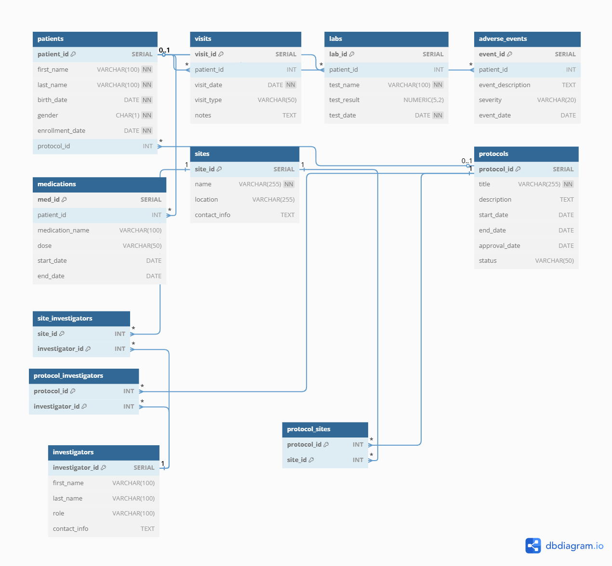

# 🧪 Clinical Trial Database Simulation

This project simulates a clinical trial database using PostgreSQL. It includes a realistic data model, mock data for patients, visits, test results, medications, adverse events, and operational structures like sites and protocols. It's designed to demonstrate my SQL and database development skills.

---

## 🧠 Description

The database replicates essential components of a clinical trial Electronic Data Capture (EDC) system, simulating:

- Patient demographics and enrollment
- Clinical visits and lab test results
- Medication records and adverse events
- Protocol management
- Site and investigator assignment

All logic-heavy operations (e.g., logging results, assigning investigators) are encapsulated using stored procedures written in PL/pgSQL.

Data was generated using Mockaroo(https://mockaroo.com) to reflect realistic clinical scenarios.

---

## 🧭 Entity Relationship Diagram (ERD)

The following diagram illustrates the relationships between all tables in the clinical trial database:



---

## 🗂 Schema Overview

| Table                    | Description                                                   |
|--------------------------|---------------------------------------------------------------|
| `patients`               | Demographic and enrollment data for each patient              |
| `visits`                 | Patient visit records with visit type and notes               |
| `labs`                   | Lab test results tied to patients                             |
| `medications`            | Medications prescribed or administered to patients            |
| `adverse_events`         | Adverse events reported during the clinical trial             |
| `sites`                  | Clinical trial sites and their locations                      |
| `investigators`          | Trial investigators and their roles/contact info              |
| `protocols`              | Protocols defining the structure and scope of clinical trails |
| `site_investigators`     | Many-to-many mapping of investigators to trial sites          |
| `protocol_sites`         | Many-to-many mapping to protocols to sites                    |
| `protocol_investigators` | Many-to-many mapping of protocols to investigators            |

---

## ⚙️ Stored Procedures

| Procedure Name                  | Purpose                                                                 |
|---------------------------------|-------------------------------------------------------------------------|
| `add_new_patient(...)`          | Inserts a new patient into the system                                  |
| `assign_investigator_to_site(...)` | Links an investigator to a clinical site                           |
| `log_lab_result(...)`           | Records a new lab test result for a patient                            |
| `record_medication(...)`        | Logs medication given to a patient with dose and duration              |
| `report_adverse_event(...)`     | Records an adverse event reported for a patient                        |

---
## 👁 Views

| View Name                   | Purpose                                                                 |
|----------------------------|-------------------------------------------------------------------------|
| `view_patient_summary`     | Combines visit and adverse event data per patient                       |
| `view_investigator_assignments` | Lists investigators and the sites they are assigned to             |
| `view_active_medications`  | Displays currently active medication records per patient                |
---

## ✅ Automated Testing

All stored procedures are tested using SQL scripts and executed via a Python test runner:
```bash

python run_sql_file.py
````
---

## 🧪 Technologies Used

- PostgreSQL
- pgAdmin
- PyCharm
- Mockaroo (data generation)
- dbdiagram.io (ERD design)
- Git / GitHub

---

## 🧠 Example SQL Queries

```sql
-- List all patients along with their most recent visit date
SELECT p.patient_id, p.first_name, p.last_name, MAX(v.visit_date) AS last_visit
FROM patients p
LEFT JOIN visits v ON p.patient_id = v.patient_id
GROUP BY p.patient_id, p.first_name, p.last_name;
    
-- Patients who experienced more than 2 adverse events
SELECT p.patient_id, p.first_name, p.last_name, COUNT(*) AS adverse_event_count
FROM patients p
JOIN adverse_events ae ON p.patient_id = ae.patient_id
GROUP BY p.patient_id
HAVING COUNT(*) > 2;

-- Average test result per test_name
SELECT test_name, ROUND(AVG(test_result), 2) AS average_result
FROM labs
GROUP BY test_name;

-- All investigators working at a specific site (e.g., site_id = 1)
SELECT s.name AS site_name, i.first_name, i.last_name, i.role
FROM site_investigators si
JOIN sites s ON si.site_id = s.site_id
JOIN investigators i ON si.investigator_id = i.investigator_id
WHERE si.site_id = 1;

```

## 🚀 Future Improvements
- Add user roles and permissions (RBAC model)
- Export test results to HTML or JSON
- Dockerize for easy setup and teardown

## 📫 Contact
Feel free to connect with me:
- GitHub: MishaAleksandrova
- LinkedIn: https://www.linkedin.com/in/mihaela-aleksandrova-856965363/

